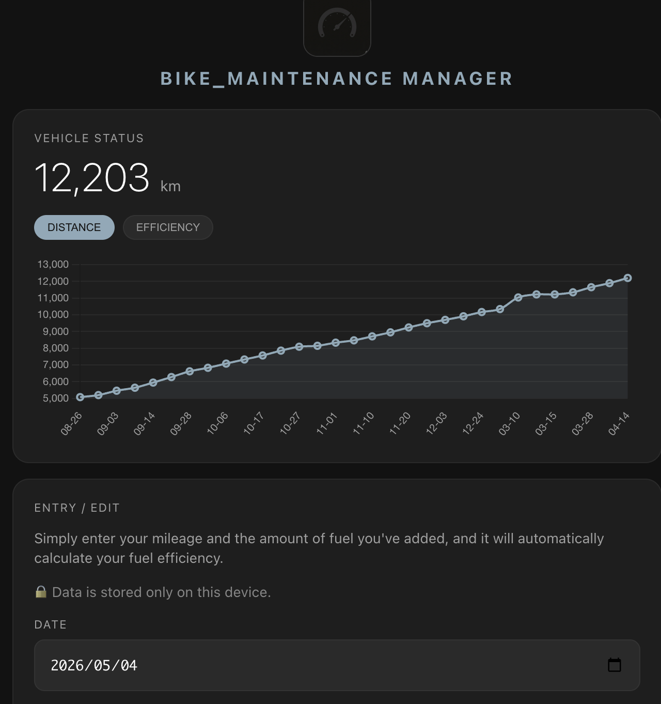

# 🏍️ MotoLog
> A simple, privacy-focused motorcycle fuel & maintenance tracker.

MotoLog is a web-based tool for riders to track mileage, fuel efficiency, and maintenance history. It runs entirely in your browser, keeping your data private on your own device.

[**🚀 Try the Live Demo**](https://umesabu3-spec.github.io/MotoLog/)

## ✨ Key Features
- 📈 **Visualize Trends**: Track your odometer and fuel efficiency over time with interactive charts[cite: 1].
- ⛽ **Smart Calculation**: Automatically calculates fuel economy (km/L) from your logs[cite: 1].
- 🔧 **Maintenance Alerts**: Get notified when it's time for an oil change or other services[cite: 1].
- 💾 **Privacy First**: Data is stored locally in your browser (localStorage)—no account required[cite: 1].
- 📥 **Data Portability**: Export and import your logs in JSON format for easy backup[cite: 1].

## 🛠️ Built With
- HTML5 / CSS3 (Dark Theme)
- Vanilla JavaScript
- Chart.js (Data Visualization)

## 🚀 Getting Started
1. Visit the [Live Demo](https://umesabu3-spec.github.io/MotoLog/).
2. Enter your date, current mileage, and fuel amount.
3. Hit **Save** to update your dashboard instantly.
4. Don't forget to use the **Backup** feature to save your data!

## 🤝 Contributing
Issues and feature requests are welcome! Feel free to check the [issues page](https://github.com/umesabu3-spec/MotoLog/issues).

## 📝 License
Distributed under the MIT License. See `LICENSE` for more information.
